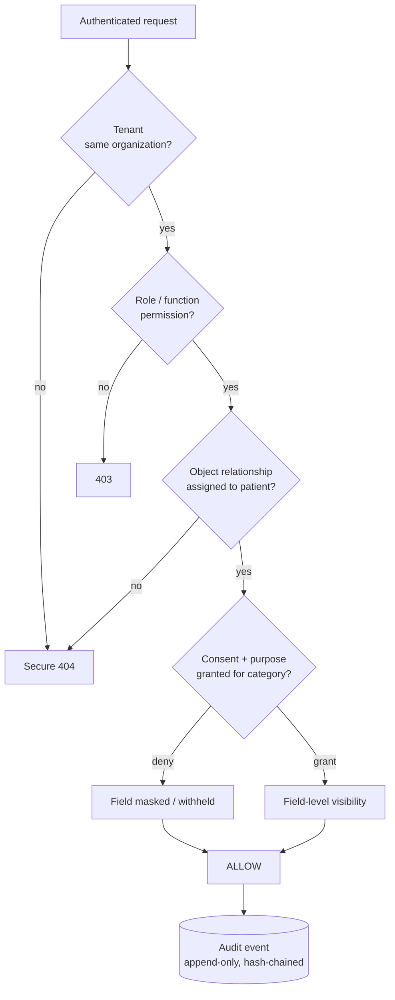
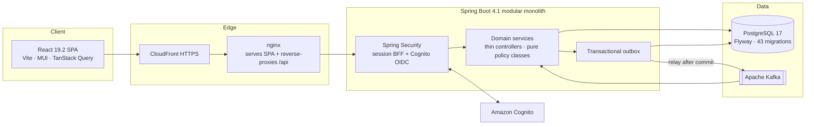
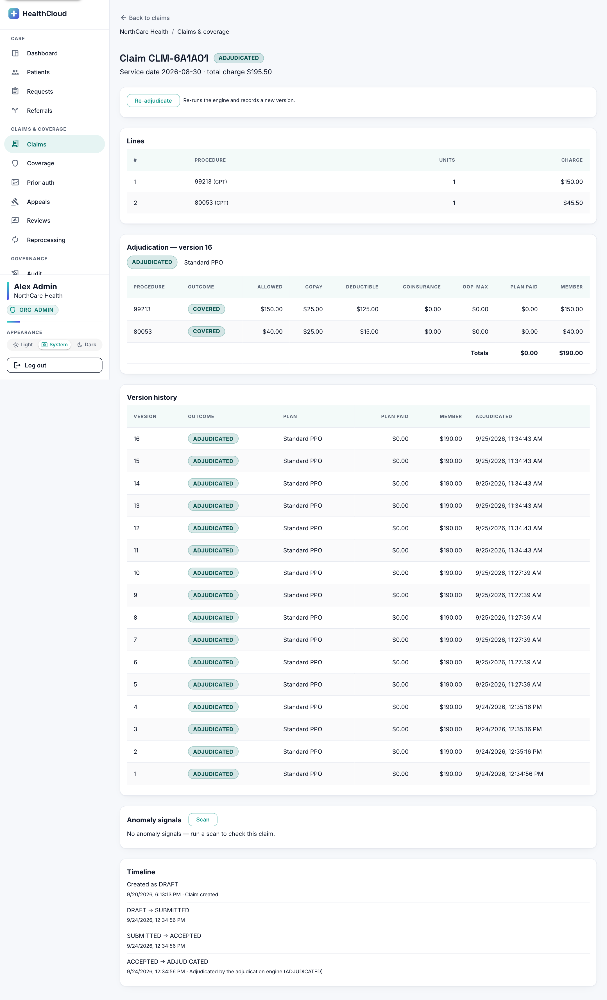
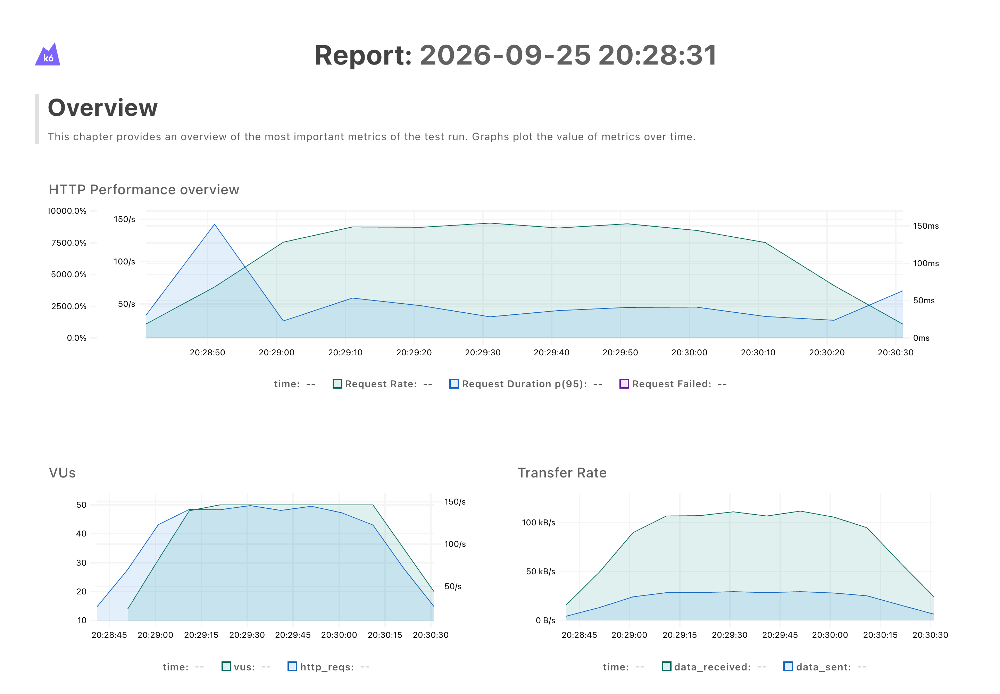
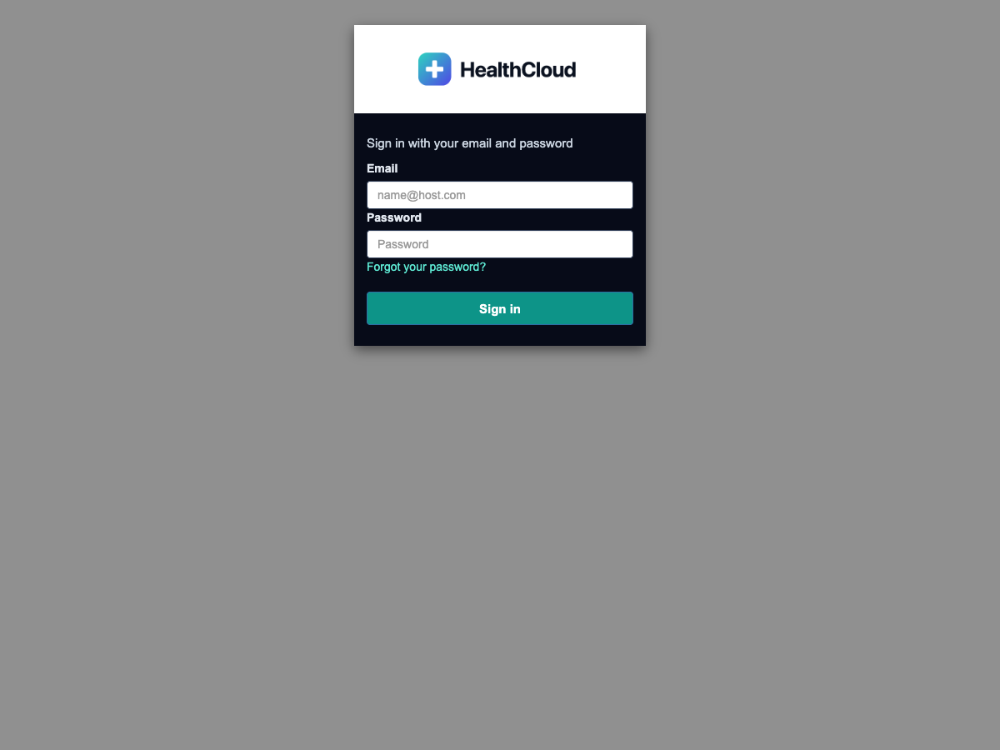
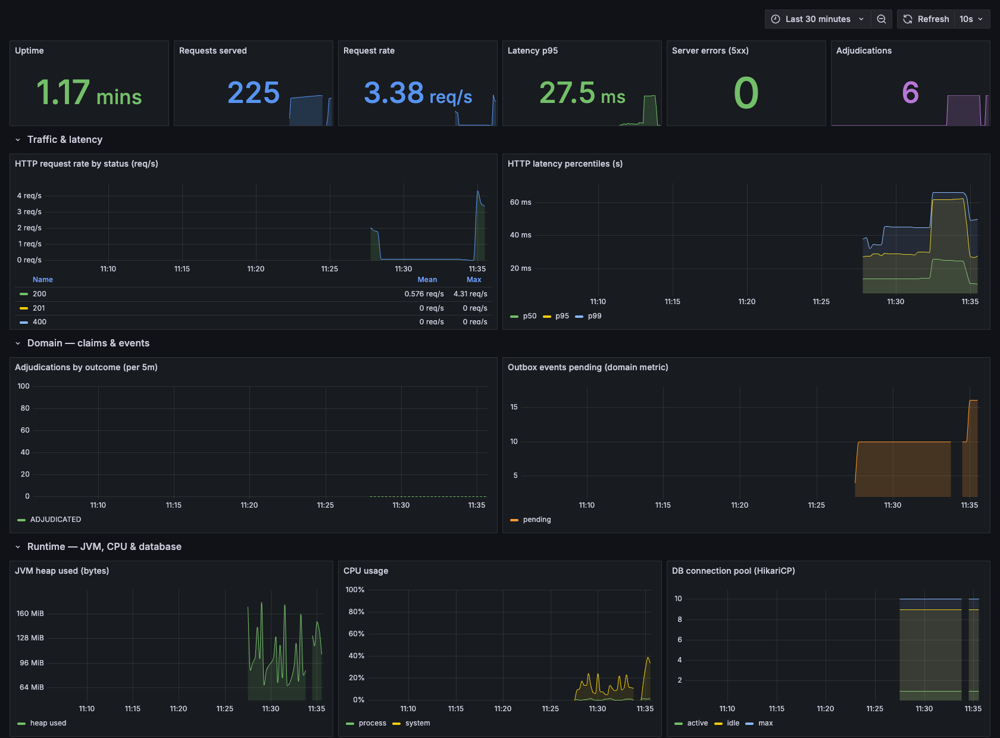
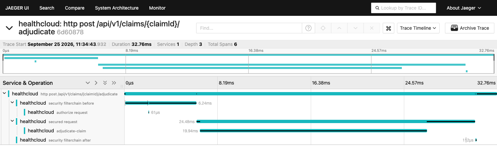

# HealthCloud — Consent-Aware Care Coordination & Claims Platform

[](https://github.com/Nikhil-Oggu/healthcloud/actions/workflows/ci.yml)


**HealthCloud** is a multi-tenant, production-grade platform for healthcare **care coordination**
and **claims adjudication**. Its engineering value is not in any single feature — it is in answering,
on every request, the question that authentication alone cannot: *should **this** person see **this**
data, for **this** reason, right now — and is that decision auditable?*

> ⚠️ This is a healthcare-**inspired**, HIPAA-**aligned** engineering portfolio project built on
> **synthetic data only**. It is **not** HIPAA-certified, is **not** used with real patient data, and
> is not production healthcare software. Every performance/security/coverage figure here is
> **measured, not claimed** — where a number would be a guess, it is labelled a *target* or omitted.

> **Feature-complete, validated, and packaged** — including a sanitized [evidence pack](docs/evidence/)
> with live security-boundary transcripts, observability captures, and an on-demand AWS deployment.
>
> 🔎 **Short on time?** Jump to the [evidence pack](docs/evidence/) (proof it actually works), the
> [security model](#security-model-deep-dive), or the [core engineering story](#the-core-engineering-story).

**Why it's interesting:** access is decided by a layered pipeline —
`identity → organization → role → patient relationship → consent → purpose of use → field-level visibility → ALLOW/DENY → audit` —
enforced entirely on the backend, backed by controlled workflow state machines, an **explainable**
synthetic claims-adjudication engine, a **tamper-evident** audit trail, event-driven reliability
(transactional outbox + Kafka), and on-demand AWS operations.

---

## Table of contents

1. [The problem](#the-problem)
2. [The core engineering story](#the-core-engineering-story)
3. [Architecture at a glance](#architecture-at-a-glance)
4. [Feature tour](#feature-tour)
5. [Security model deep-dive](#security-model-deep-dive)
6. [Technology stack](#technology-stack)
7. [Testing & quality](#testing--quality)
8. [Cloud deployment & operations](#cloud-deployment--operations)
9. [Run it locally](#run-it-locally)
10. [Repository layout](#repository-layout)
11. [Honest limitations & scope](#honest-limitations--scope)
12. [Documentation index](#documentation-index)
13. [License & disclaimer](#license--disclaimer)

---

## The problem

Healthcare-style workflows involve many participants — patients, providers, care coordinators,
claims reviewers, administrators, auditors — who must each see **different data for different reasons**.
Authentication only answers *who you are*. It does not answer whether you:

- belong to the **right organization** (tenant),
- are in an active **care relationship** with this patient,
- have the patient's **consent** for this category of data,
- have a permitted **purpose of use**,
- have a **business need** for a specific field, or
- may perform a given **action** in the current workflow state.

Most tutorials stop at "logged-in + has role X." Real systems that touch sensitive data cannot. The
hard, interesting engineering is in the layers *after* authentication — and in proving, after the
fact, that every sensitive action was authorized and recorded. That is what HealthCloud is built to
demonstrate.

---

## The core engineering story

Every protected read passes through independent backend layers, **in order**. Each layer can only
*narrow* access; none can widen it. A relationship/consent denial is returned as a **secure 404** —
never a 403 that would confirm the record exists.



Key properties that make this real rather than decorative:

- **The backend is the only security boundary.** The frontend may hide or disable UI for convenience,
  but every protected operation is authorized server-side. Tenant/org identity is **derived from the
  session on the backend**, never trusted from the client.
- **Roles are resolved fresh from the database by email on every request** — never from the login
  token — so a Cognito login establishes *identity* only; *authority* always comes from the DB.
- **One choke point for the relationship layer.** Every patient-scoped read routes through a single
  `PatientAccessGuard`, so the gate cannot be side-stepped by a new endpoint.
- **Deny-by-default consent + field masking.** A consent-controlled field is withheld unless an
  applicable grant exists; a masked field comes back `null` and is named in a `maskedFields` list —
  and it never resurfaces in logs, exports, or events.

---

## Architecture at a glance

HealthCloud is a **modular monolith** (no microservices) over a **shared PostgreSQL** database with
an `organization_id` tenant key on every tenant-owned row.



Conventions that recur throughout the codebase:

- **Thin controllers.** Business rules, authorization, state transitions, claim math, audit creation,
  and event creation live in dedicated service/domain components.
- **One transaction per important state change.** The domain change **+** its status/version history
  row **+** the audit event **+** the outbox event all commit atomically; the Kafka publish happens
  only *after* commit, via the outbox relay.
- **Pure policy classes.** Decision logic (six state machines, the consent evaluator, the anomaly
  detector, the audit hash-chain math) lives in Spring-free, unit-testable classes; a thin service
  loads data and applies the policy.
- **Concurrency:** optimistic locking (version columns) for requests/claims/consent/assignments; row
  locks for financial accumulators.
- **Schema is owned by Flyway** (43 migrations); Hibernate runs `ddl-auto: validate` and never
  generates DDL.

The backend is organized into 30 domain packages under `com.healthcloud` (a sample:
`patient`, `consent`, `relationship`, `claim`, `adjudication`, `coverage`, `priorauth`, `appeal`,
`audit`, `breakglass`, `outbox`, `deadletter`, `common`).

---

## Feature tour

Built one verified slice at a time across 12 phases. Highlights by domain:

- **Multi-tenant identity & access** — organizations, facilities, users, roles, memberships;
  session-based auth with a Cognito OIDC BFF; cross-tenant access returns a secure 404.
- **Care coordination** — patients, provider/coordinator care-team assignments, and service requests
  driven by a controlled state machine with a full status timeline, comments, and optimistic locking.
- **Consent, privacy & documents** *(the flagship differentiator)* — versioned consent directives, a
  consent + purpose-of-use decision engine, field-level masking, and secure document upload/download
  with malware-scan quarantine — so two users with the *same role* can get *different results*.
- **Clinical context & claims intake** — a global ICD-10-CM / CPT / HCPCS code catalog, consent-masked
  clinical summaries, and a claim aggregate (header + coded lines) with a submission/validation
  workflow — a claims reviewer sees claim-relevant data *without* unrestricted medical context.
- **Explainable adjudication engine** — a deterministic engine that turns an accepted claim into an
  itemized decision (eligibility → coverage → allowed amount → deductible → copay → coinsurance →
  out-of-pocket max → exclusions → prior-auth → provider network), with cross-claim benefit
  accumulators and immutable, versioned re-adjudication. For any decision it can show which plan
  applied and how every dollar was computed.

  

- **Advanced claims** — prior authorization, referrals, appeals (wired into re-adjudication), anomaly
  signals, manual review, batch reprocessing, and provider-network enforcement.
- **Security & governance** — an append-only audit log made **tamper-evident** with a per-org
  HMAC-SHA256 hash chain and an integrity-verify endpoint; HIPAA-style **break-glass** emergency
  access (time-boxed, audited); admin access review; and operational-data retention.
- **Event-driven reliability** — a transactional outbox → relay → Kafka → **idempotent** consumer →
  retry/backoff → dead-letter topic → drain → inspect → replay, all with an ops UI.
- **Search, reporting & accessibility** — server-side pagination + filtering + free-text search across
  all eight work queues, CSV export that inherits field masking, and a WCAG 2.2 AA-*aligned* pass
  (automated axe-core gate + app-shell semantics).

---

## Security model deep-dive

- **Tenant isolation.** Every tenant-owned query is constrained by the backend-derived
  `organization_id`; rows are loaded by `(organization_id, id)` so another tenant's row simply isn't
  found. Proven by dedicated `TenantIsolation*` tests, extended whenever a tenant-owned resource is
  added.
- **Secure 404 for existence-sensitive denials.** A relationship/consent denial never reveals that a
  record exists.
- **Field-level masking.** The backend builds field-safe DTOs; the read's *purpose* is fixed per
  action on the backend (not chosen by the client); consent-controlled fields are evaluated
  deny-by-default. The masked value is `null` in the response and listed in `maskedFields`.
- **Tamper-evident audit trail.** Each audit event is a link in a per-org HMAC-SHA256 hash chain
  (`sequence_no` + `prev_hash` + `entry_hash`) appended under a pessimistic row lock; the per-org key
  is derived from a master secret held in configuration, **not** in the database it protects. A verify
  endpoint recomputes the chain and detects any modified, deleted, reordered, inserted, or truncated
  row.
- **Break-glass.** A provider can self-grant time-boxed emergency access to a patient they are not
  assigned to, with a recorded reason; it overrides *only* the relationship layer (never tenant
  isolation or consent masking), expires automatically, can be revoked early, and is fully audited.
- **Session & CSRF.** An HttpOnly session cookie (Spring Session JDBC) plus a readable `XSRF-TOKEN`
  cookie echoed as an `X-XSRF-TOKEN` header; state-changing requests require the CSRF handshake.
- **No sensitive data in logs, errors, or event payloads.** Errors use one shape
  `{code, message, correlationId, details}`; event and audit payloads carry only coded, PHI-free
  metadata.

---

## Technology stack

| Layer | Technology |
|---|---|
| **Backend** | Java 25 · Spring Boot 4.1.0 · Spring Security · Spring Data JPA/Hibernate · Spring Session JDBC · Spring Kafka · Micrometer + OpenTelemetry |
| **Database** | PostgreSQL 17 · Flyway (43 migrations) |
| **Frontend** | React 19.2 · TypeScript 6 · Vite 8 · React Router 7 · TanStack Query 5 · React Hook Form + Zod · Material UI 9 |
| **Messaging** | Apache Kafka (KRaft locally) |
| **Auth** | Amazon Cognito (OIDC auth-code) + Spring Boot BFF; HttpOnly session cookie + CSRF |
| **Cloud** | AWS ECS Fargate · RDS · S3/CloudFront · Cognito · Terraform (IaC) |
| **CI/CD** | GitHub Actions → GHCR container images |
| **Testing** | JUnit 5 · Testcontainers · MockMvc · Vitest · React Testing Library · axe-core |

Architecture: **modular monolith**, shared-DB multi-tenancy, hybrid RBAC + attribute-based
authorization. Versions are the frozen baseline; major upgrades require an ADR.

---

## Testing & quality

Tests are written *alongside* each slice, not bolted on at the end — and **negative/security tests
are first-class** (cross-tenant denial, consent denial, invalid transitions are the *proof*, not an
afterthought).

**Measured, full-suite run (2026-09-24):**

| Suite | Result |
|---|---|
| Backend (`mvnw clean verify`, Testcontainers → real PostgreSQL per test) | **511 tests** — 0 failures, 0 errors, 0 skipped |
| Frontend `tsc --noEmit` (typecheck) | clean |
| Frontend tests (Vitest, 40 files) | **183 tests** — 0 failures |
| Frontend production build | succeeds |
| **Total** | **694 tests, all green** |

- **Real dependencies, not mocks, for data access.** Repository and full HTTP/session flows run
  against a real PostgreSQL via Testcontainers; full flows use a random-port server + a real HTTP
  client so session cookies and CSRF are exercised end-to-end.
- **CI gates** (`.github/workflows/ci.yml`, on push + PR to `main`): a backend job (`mvnw verify`), a
  frontend job (typecheck → test → build), and backend/frontend container-image builds published to
  GHCR on `main`.
- **Review discipline.** Project-specific `code-reviewer` and `security-reviewer` subagents encode
  HealthCloud's own invariants (tenant scoping, the authorization layering, one-transaction + history,
  field-masking leaks, PHI-in-logs, financial double-apply) and run before security-sensitive commits.
- **Load-tested (honestly).** A [k6](https://k6.io) load test ([`perf/k6/read-path.js`](perf/k6/read-path.js))
  drives the authenticated read path — login → tenant-scoped, relationship-gated list reads — at **50
  concurrent users**. Measured on a **local, single-node dev setup**: **~107 requests/sec at a p95 latency
  of 38 ms with a 0% error rate** over 12,947 requests. These are an honest local signal, deliberately
  *not* quoted as a production/SLA figure (see the no-unmeasured-claims rule) — full results, environment,
  and scope caveat in [`docs/evidence/load-test.md`](docs/evidence/load-test.md).

  
  *k6's built-in web dashboard for a run of the read-path test: request rate (green) ramps to the 50-VU plateau, p95 latency (blue) stays low, and failures (purple) hold at zero.*

---

## Cloud deployment & operations

- **Infrastructure as code.** All AWS resources are defined in Terraform (`infrastructure/terraform/`)
  with S3 remote state and native locking. Topology: one VPC across two AZs, public subnets for the
  ALB + Fargate, private subnets for RDS — **no NAT Gateway** (a deliberate ~$32/mo saving).
- **The deployed shape.** One Fargate task holds both containers (backend + nginx) over localhost;
  images run on ARM64/Graviton; the RDS and Cognito secrets are injected from Secrets Manager (never
  in code or state); CloudFront terminates HTTPS in front of the ALB so the live Cognito OIDC login
  completes over HTTPS.

  

- **Cost discipline.** The stack is **on-demand**: `apply → capture evidence → terraform destroy`
  back to ~$0 (the state bucket is kept). It is **not** left running. This project ran on a personal
  AWS account with credits; the app itself costs roughly $0.08–0.10/hr while up.
- **Observability.** Micrometer → Prometheus metrics (`/actuator/prometheus`), an 18-panel Grafana
  "HealthCloud Overview" dashboard, distributed tracing via OpenTelemetry → Jaeger, Kubernetes-style
  liveness/readiness probes, Prometheus alert rules, a non-destructive backup/restore drill, and
  runbooks — all runnable locally behind an opt-in Docker Compose profile.

  

  *Grafana "HealthCloud Overview" (18 panels): request rate, p95 latency, 0 server 5xx, JVM/CPU/DB, and the `healthcloud_adjudications_total` domain counter — all measured values.*

  

  *Jaeger: one request's distributed trace, with the `@Observed` `adjudicate-claim` span nested under the HTTP server span (OpenTelemetry over OTLP).*

  Full observability evidence — including the Prometheus scrape targets — is in
  [`docs/evidence/observability.md`](docs/evidence/observability.md).

> **Honesty note:** thresholds in the alert rules are demo *targets*, not measured SLOs; Prometheus/
> Jaeger are wired locally, with AWS wiring documented as an on-demand follow-up.

---

## Run it locally

Prerequisites: **Docker Desktop**, **JDK 25**, **Node 24**. (Interactive shells get the toolchain
from your profile; the commands below assume `java`, `node`, and `docker` are on `PATH`.)

```bash
# 1. Start infrastructure (PostgreSQL; add kafka for the event-driven features)
docker compose up -d postgres

# 2. Run the backend (seeds synthetic demo data + enables the local dev-login)
cd backend && ./mvnw spring-boot:run -Dspring-boot.run.profiles=local

# 3. Run the frontend (Vite dev server on :5173, proxies /api → :8080)
cd frontend && npm install && npm run dev
```

Then open **http://localhost:5173**. In local dev, the login page offers a **Developer sign-in**
(email only, no password) for each seeded role in both demo organizations.

Quick backend checks:

```bash
# Health
curl localhost:8080/actuator/health

# Log in as a provider and read the current user
curl -c j -X POST localhost:8080/api/v1/dev-login --data email=provider@northcare.example.org
curl -b j localhost:8080/api/v1/me
```

Other useful commands:

```bash
cd backend && ./mvnw test        # backend tests (Testcontainers → Docker required)
cd frontend && npm test          # frontend tests (Vitest)
cd frontend && npm run typecheck # TypeScript typecheck
docker compose --profile observability up -d prometheus grafana jaeger  # metrics/traces/dashboards
```

Two synthetic tenants are seeded — **NorthCare Health** and **Green Valley Clinic** — with a full set
of roles each (patient, provider, care coordinator, claims reviewer, admin, auditor). Two
organizations is the minimum needed to *prove* tenant isolation.

---

## Repository layout

```
backend/         Spring Boot modular monolith (30 domain packages under com.healthcloud)
frontend/        React + TypeScript SPA (feature folders mirroring the backend domains)
worker/          reserved for out-of-process workers
infrastructure/  terraform/ (AWS IaC) + observability/ (Prometheus, Grafana, Jaeger config)
api/openapi/     API surface
docs/            PLAN.md · PROGRESS.md · adr/ · runbooks/ · design/ · learning/ · source-of-truth/
scripts/         db-reset / db-backup / db-restore-drill
.github/         CI workflows
docker-compose.yml · CLAUDE.md
```

---

## Honest limitations & scope

This project is deliberate about what it is *not*:

- **Synthetic data only.** No real patient, provider, employer, or production data — ever.
- **HIPAA-aligned, not certified.** It follows healthcare-style access and audit patterns; it is not
  certified healthcare software and must not be used with real PHI.
- **Accessibility is AA-*aligned*, not audited.** An automated axe-core gate plus keyboard/landmark/
  heading criteria and in-browser contrast checks on core screens — not a full page-by-page audit or a
  Playwright + axe E2E gate (both documented follow-ups).
- **Single-instance outbox relay.** At-least-once delivery via a scheduled poller; multi-instance
  needs `SELECT … FOR UPDATE SKIP LOCKED`.
- **No MSK on AWS.** The event-driven system is proven locally with Kafka; managed Kafka was omitted
  from the cloud deploy on cost grounds.
- **On-demand cloud only.** The AWS environment is stood up to capture evidence and then destroyed, so
  there is no always-on public URL.
- **No unmeasured claims.** Any figure not backed by an actual measurement is labelled a *target* or
  omitted.

---

## Documentation index

- **Evidence pack** *(start here for proof):* [`docs/evidence/`](docs/evidence/) — measured test
  results, a [k6 load-test capture](docs/evidence/load-test.md) (local single-node), live
  security-boundary HTTP transcripts (cross-tenant secure-404, consent masking, relationship gate,
  invalid-transition), observability captures (Grafana/Prometheus/Jaeger), 11 app UI screenshots, and
  the live AWS deployment.
- **Architecture decisions:** [`docs/adr/`](docs/adr/)
- **Runbooks:** [`docs/runbooks/`](docs/runbooks/) (triage workflow, alert response, backup & restore)
- **Architecture diagrams:** [`docs/architecture/architecture.md`](docs/architecture/architecture.md) (deployment · module map · request/authorization pipeline · event flow)
- **Entity-relationship diagram:** [`docs/er-diagram/er-diagram.md`](docs/er-diagram/er-diagram.md) (the 50-table data model, by domain)
- **Threat model:** [`docs/threat-model/threat-model.md`](docs/threat-model/threat-model.md) (STRIDE over the real trust boundaries)
- **Design system:** [`docs/design/design-system.md`](docs/design/design-system.md)

---

## License & disclaimer

HealthCloud is an engineering portfolio project. It is **not** medical software, **not** HIPAA-certified,
and is built and tested exclusively on **synthetic data**. Nothing here should be used to store or
process real personal health information.
