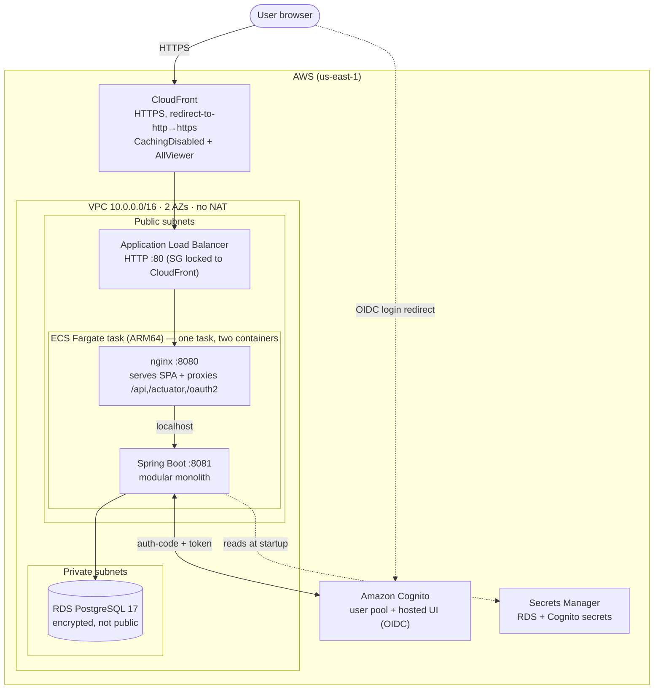
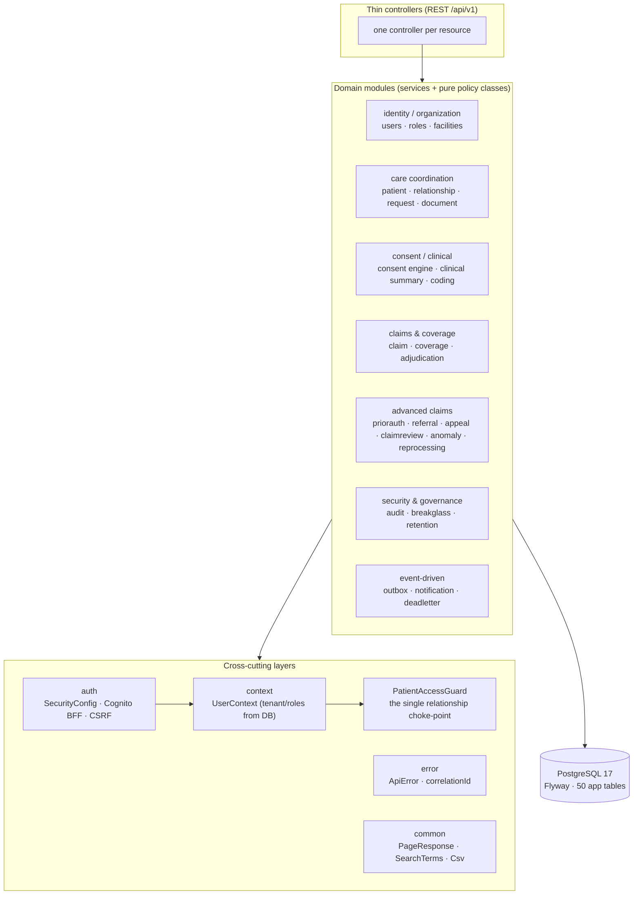
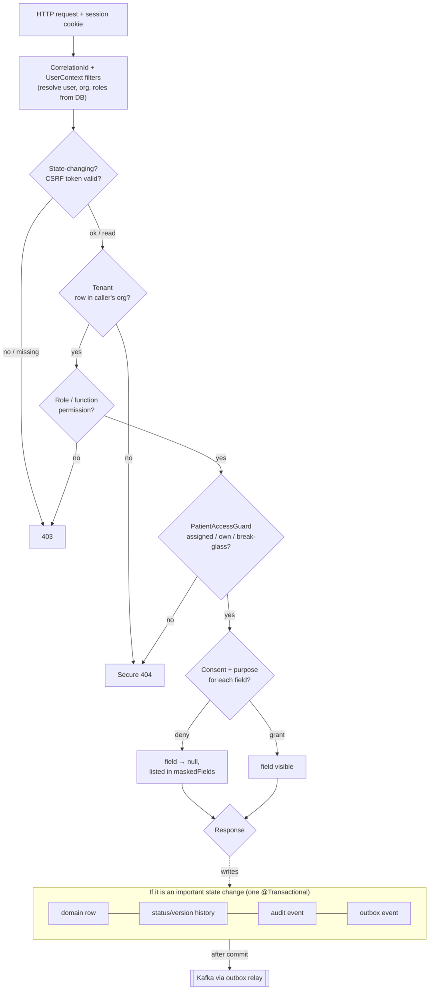
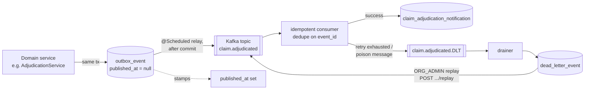

# HealthCloud — Architecture

> Diagrams are written as [Mermaid](https://mermaid.js.org/) so they render natively on GitHub and stay
> version-controlled as text. They reflect the system as actually built (Phases 0–11); where something is
> a deliberate simplification for cost or scope, it is called out honestly.

- [1. Deployment / system topology (AWS, on-demand)](#1-deployment--system-topology-aws-on-demand)
- [2. Module map (the modular monolith)](#2-module-map-the-modular-monolith)
- [3. Request lifecycle & authorization pipeline](#3-request-lifecycle--authorization-pipeline)
- [4. Event-driven flow (outbox → Kafka → replay)](#4-event-driven-flow-outbox--kafka--replay)

---

## 1. Deployment / system topology (AWS, on-demand)

The cloud environment is stood up with Terraform, used to capture evidence, then destroyed (`apply → demo →
destroy`) to keep cost near zero — so there is no always-on public URL. When up, the shape is:

**Notes.**
- **One Fargate task holds both containers** (nginx + backend) talking over `localhost` — the cheapest shape;
  the images run unchanged (only env vars differ from local). Because awsvpc containers share a network
  namespace and nginx is fixed to 8080, the backend runs on **8081**.
- **No NAT Gateway** (a deliberate ~$32/mo saving): Fargate reaches the internet via the public subnet; RDS
  in the private subnets needs no egress.
- **CloudFront terminates HTTPS** in front of the ALB (a free `*.cloudfront.net` cert), which is what lets the
  Cognito OIDC login complete over HTTPS.
- **Secrets never live in code or Terraform state** — the RDS master password and the Cognito client secret are
  injected from Secrets Manager at runtime.
- **No MSK.** The event-driven system (below) is proven locally with Kafka; managed Kafka was omitted from the
  cloud deploy on cost grounds.

---

## 2. Module map (the modular monolith)

The backend is a single deployable (a **modular monolith**) organized into ~30 domain packages under
`com.healthcloud`, over a set of cross-cutting layers. Business logic lives in services and pure policy
classes; controllers stay thin.

**Notes.**
- **Thin controllers.** Authorization, state transitions, claim math, audit creation, and event creation live
  in services/domain components — never in controllers.
- **Pure policy classes** hold decision logic with no Spring/DB dependency and are unit-tested in isolation: six
  state machines (request/claim/prior-auth/referral/appeal/claim-review), the consent evaluator, the anomaly
  detector, and the audit hash-chain math.
- **One relationship choke-point.** Every patient-scoped read routes through `PatientAccessGuard`, so the access
  gate can't be bypassed by adding a new endpoint.
- **Tenant context is derived on the backend** (`UserContext`) from the session; roles/org are resolved fresh
  from the DB by email on each request — never trusted from the client.

---

## 3. Request lifecycle & authorization pipeline

Every protected read passes through independent backend layers **in order**. Each layer can only *narrow*
access. A relationship/consent denial is a **secure 404** (never a 403 that would confirm the row exists). An
important write additionally commits its history + audit + outbox rows in the **same transaction**.

**Notes.**
- **Backend is the only security boundary.** The SPA may hide/disable UI, but every check above runs
  server-side, gated off the caller's *actual* roles from `UserContext`.
- **Field masking is deny-by-default** and the read's *purpose* is fixed per action on the backend, not chosen
  by the client. Masked values are `null` and named in a `maskedFields` list — and never leak into logs/exports.
- **Optimistic locking** (a client-supplied `expectedVersion` vs the row's `@Version`) guards concurrent state
  changes; financial accumulators use row locks.

---

## 4. Event-driven flow (outbox → Kafka → replay)

A Kafka publish cannot join a database transaction (the dual-write problem). HealthCloud uses the
**transactional outbox** pattern: the event row is written inside the domain transaction, and a relay publishes
it to Kafka only *after* commit. The consumer is idempotent, and failures are retried, dead-lettered, and
replayable.

**Notes.**
- **At-least-once** delivery, made safe by an **idempotent** consumer (`UNIQUE(event_id)` backstop) — a
  redelivery or a double-click replay is harmless.
- **Structural failures** (bad header, malformed payload) skip retries and go straight to the DLT so a poison
  record never blocks the partition.
- **Single-instance relay** today (a scheduled poller); multi-instance would need
  `SELECT … FOR UPDATE SKIP LOCKED`.
- Event payloads are minimum-necessary and **PHI-free** (coded ids + amounts, no clinical data).

---

See also the **[entity-relationship diagram](../er-diagram/er-diagram.md)** for the data model behind these
flows, and the main **[README](../../README.md)** for the project overview.
