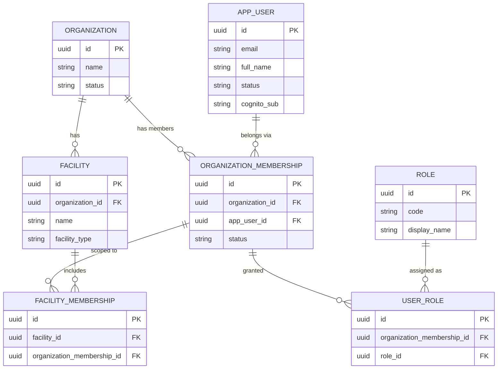
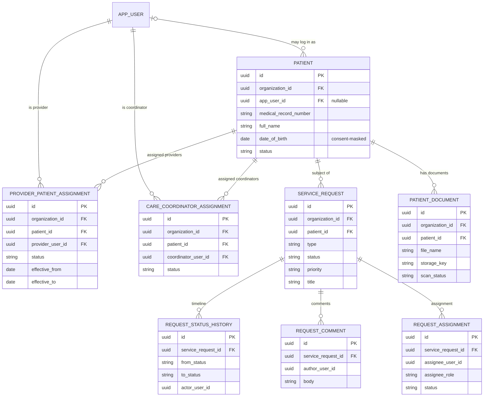
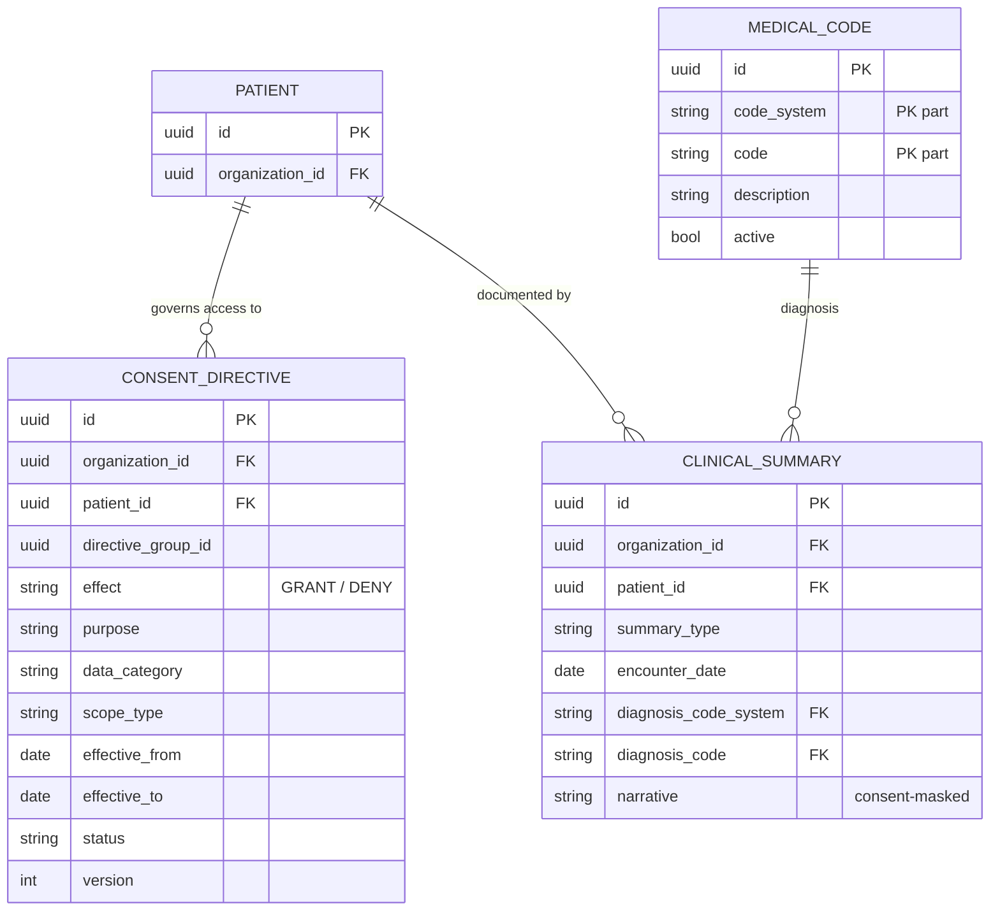
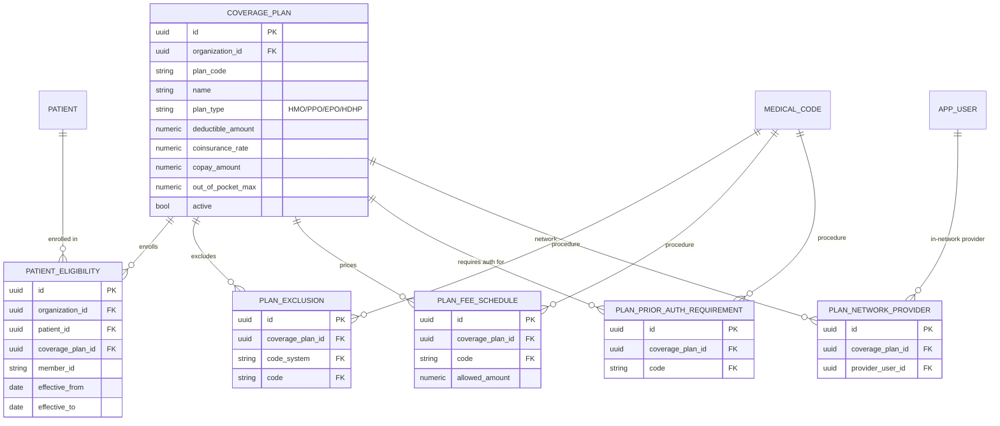
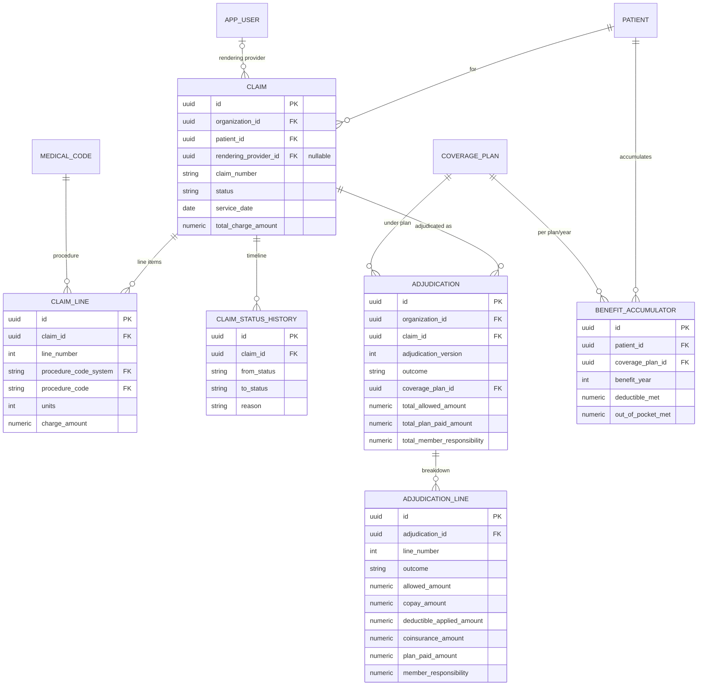
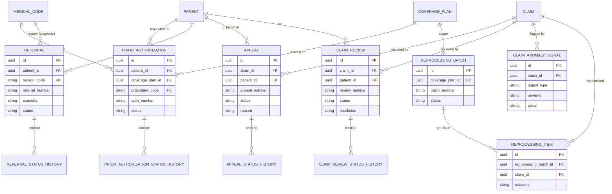
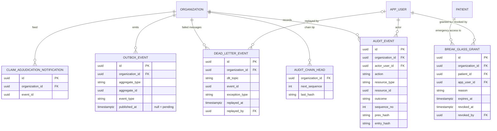

# HealthCloud — Entity-Relationship Diagram

> Generated from the real schema (43 Flyway migrations → **50 application tables**, plus Spring Session's two
> tables and Flyway's history table). Rendered as [Mermaid](https://mermaid.js.org/) `erDiagram` blocks so they
> render on GitHub and stay version-controlled as text.
>
> To stay readable, the model is split by domain and each entity shows **key columns** (primary key, tenant key,
> foreign keys, and a few business columns), not every column. Timestamps/`version` columns are mostly omitted.

## The multi-tenancy pattern (read this first)

Every tenant-owned table carries an **`organization_id`** tenant key, and child tables **foreign-key *with* the
org** — i.e. `(child.parent_id, child.organization_id)` references `parent(id, organization_id)`, not just
`parent(id)`. This makes tenant isolation *structural*: a child row can never point at a parent in a different
tenant. In the diagrams below the relationship lines show the logical parent→child link; the composite
"`+ organization_id`" half of each foreign key is implied by this pattern rather than drawn on every edge.

Reference data that is **not** tenant-owned: `medical_code` (the global ICD-10-CM / CPT / HCPCS catalog) and
`role` are shared across all organizations and have no `organization_id`.

- [1. Tenancy & identity](#1-tenancy--identity)
- [2. Care coordination](#2-care-coordination)
- [3. Consent & clinical](#3-consent--clinical)
- [4. Coverage plans & configuration](#4-coverage-plans--configuration)
- [5. Claims & adjudication](#5-claims--adjudication)
- [6. Advanced claims](#6-advanced-claims)
- [7. Security, audit & events](#7-security-audit--events)

---

## 1. Tenancy & identity

An `organization` is the tenant. Users join an org through an `organization_membership`, which carries their
`user_role`s and optional `facility_membership`s.

> Roles/org are resolved fresh from these tables by email on every request — a Cognito login establishes
> identity only, never authority.

---

## 2. Care coordination

A `patient` may optionally link to an `app_user` login (self-service). Provider and coordinator **care-team
assignments** are what the relationship access gate checks. Service requests carry a status history, comments,
and an assignment.

---

## 3. Consent & clinical

Consent directives are versioned and evaluated deny-by-default. Clinical summaries point at a diagnosis in the
global `medical_code` catalog; their free-text `narrative` is the consent-masked field.

> `medical_code` is global reference data (no `organization_id`); it is keyed by `(code_system, code)`, which is
> the composite target the clinical/claim/plan tables foreign-key to.

---

## 4. Coverage plans & configuration

A `coverage_plan` holds the benefit parameters the adjudication engine applies, plus four kinds of per-plan
configuration. A `patient_eligibility` row enrolls a patient in a plan for an effective-dated period.

---

## 5. Claims & adjudication

A `claim` owns coded `claim_line`s and a status history. Adjudicating it writes an immutable, versioned
`adjudication` (header + per-line breakdown). A `benefit_accumulator` carries the deductible/out-of-pocket met
across claims per `(patient, plan, year)`.

---

## 6. Advanced claims

Prior authorizations, referrals, appeals, and manual reviews each follow the same aggregate + status-history
shape. Anomaly signals are advisory findings on a claim; reprocessing batches re-adjudicate a plan's claims.

> Each status-history table (`*_status_history`) is append-only and shares the shape
> `{ from_status, to_status, actor_user_id, reason, correlation_id, created_at }` — omitted above for brevity.

---

## 7. Security, audit & events

The audit trail is append-only and tamper-evident (a per-org HMAC hash chain, with `audit_chain_head` holding
the chain tip). Break-glass grants time-boxed emergency access. The outbox/notification/dead-letter tables are
the event-driven backbone.

> Audit events are **permanent** — never purged (that would break the hash chain). Data retention purges only
> long-expired operational rows (e.g. `break_glass_grant`), and the purge is itself audited.

---

See also the **[architecture diagrams](../architecture/architecture.md)** for the runtime/deployment view, and
the main **[README](../../README.md)** for the project overview.
