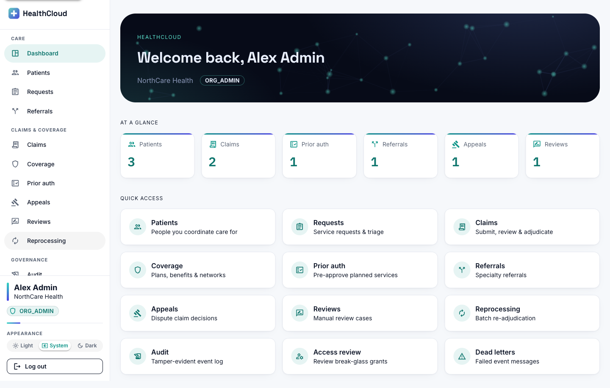

# Evidence — Live AWS Deployment

> Captured 2026-09-25 against the app deployed on AWS and reached over **HTTPS via CloudFront**.
> The environment was stood up on demand with `terraform apply`, captured, and torn down with
> `terraform destroy` afterward to control cost. All data is synthetic.

## Architecture (recap)

The deploy is Terraform-managed: **CloudFront** (HTTPS) → **Application Load Balancer** → **ECS
Fargate** (one task, backend + frontend nginx, ARM64) → **RDS PostgreSQL** (private, encrypted,
password in Secrets Manager), with **Amazon Cognito** as the OIDC identity provider. This apply was
**7 resources added, 0 destroyed** (the VPC/RDS/ECR were already in place). See
[`../adr/ADR-012-ecs-fargate-target-deployment.md`](../adr/ADR-012-ecs-fargate-target-deployment.md)
and [`../adr/ADR-015-on-demand-full-aws-validation.md`](../adr/ADR-015-on-demand-full-aws-validation.md).

## Live app over HTTPS

The deployed landing page, served over HTTPS through CloudFront. Sign-in is **only via Cognito** — the
local `dev-login` bypass is compiled out and disabled on the deploy (the `demo,cognito` profile), so
Cognito is the single path in.


## Real Amazon Cognito login

Clicking "Sign in" redirects (OIDC authorization-code + PKCE) to the **Amazon Cognito hosted login** —
real managed authentication, not an app-rendered form. The hosted UI carries the HealthCloud branding
(logo, dark theme, teal accent) applied to the app client.


## Authenticated on the cloud

After a successful Cognito login, the session is established on the CloudFront URL and the app resolves
the user's identity: **Alex Admin**, `admin@northcare.example.org`, organization **NorthCare Health**,
role **ORG_ADMIN**. Cognito supplies identity; the **roles and tenant come from the application
database** (never from the token) — the layered security model working end-to-end on AWS.



## What this proves

- The app **deploys to AWS** (Terraform, reproducible) and is reachable over **HTTPS** via CloudFront.
- **Real Cognito OIDC** authentication works end-to-end on the deployed URL (authorization-code + PKCE).
- Identity from Cognito, **roles/tenant from the DB** — the same authorization model proven locally,
  running in the cloud.

> **Build note.** For this capture the current frontend + backend images were rebuilt (ARM64) and
> pushed to ECR, and the deployed Cognito app client was branded to match the app — so these cloud
> screenshots reflect the current build. Per the project workflow, ECR images are pushed manually
> (`crane`) rather than from CI, and the Cognito hosted-UI branding is applied via the AWS CLI (it is
> not yet in Terraform — a documented drift item in `CLAUDE.md`).

## Reproduce

```bash
cd infrastructure/terraform
terraform apply     # ~10–15 min (CloudFront is the long pole); prints cloudfront_url
# … capture / demo …
terraform destroy   # return to ~$0 (the S3 state bucket is kept)
```
