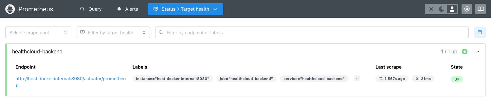

# Evidence — Observability (metrics, dashboards, tracing)

> Captured 2026-09-25 against the local `observability` stack (Prometheus, Grafana, Jaeger) with the
> backend running under the `local` profile and Kafka up. Traffic was generated synthetically (a burst
> of API reads plus six claim re-adjudications). All values shown are **measured**.

## Metrics dashboard — Grafana "HealthCloud Overview"

The auto-provisioned dashboard (18 panels): a headline stat row, then Traffic & latency, Domain
(claims & events), and Runtime (JVM/CPU/DB) sections. The headline shows the measured burst —
uptime, requests served, request rate, **HTTP p95 latency**, 5xx errors (**0**), and the
`healthcloud_adjudications_total` domain counter (**6**).


Notable panels:
- **HTTP request rate by status** and **HTTP latency percentiles (p50/p95/p99)** — from the
  Micrometer `http.server.requests` histogram.
- **Adjudications by outcome** and **Outbox events pending** — domain metrics
  (`healthcloud_adjudications_total`, `healthcloud_outbox_pending`) proving the app emits its own
  business + reliability signals, not just framework metrics.
- **Runtime** — JVM heap, CPU, HikariCP DB pool, threads, GC — the standard health signals.

## Scrape pipeline — Prometheus targets

Prometheus scrapes the backend's `/actuator/prometheus` endpoint. The target is **1/1 UP**, last
scrape ~3s ago in ~53ms — the metrics pipeline is live end-to-end.



## Distributed tracing — Jaeger

A single claim-adjudication request, traced end to end. The trace has **6 spans at depth 3**: the
HTTP span `http post /api/v1/claims/{claimId}/adjudicate` at the root, the Spring Security filter
spans, and — nested under the secured request — the custom **`adjudicate-claim`** business span
(the `@Observed` method on `AdjudicationService.adjudicate`). This is what makes a money decision
traceable from the HTTP entry point down into the domain logic.


## What this proves

- **Metrics** — the app exports framework *and* domain metrics; Grafana visualizes them on a
  provisioned dashboard.
- **Scraping** — Prometheus is actually pulling those metrics (target UP).
- **Tracing** — requests carry a trace with a custom business span, so a decision can be followed
  across the HTTP → security → domain boundaries (and, in the running system, across Kafka via
  observation propagation).

See the observability conventions and the alert rules / runbooks in
[`../runbooks/`](../runbooks/) and `infrastructure/observability/`.

## Reproduce

```bash
docker compose up -d postgres kafka
docker compose --profile observability up -d prometheus grafana jaeger
cd backend && ./mvnw spring-boot:run -Dspring-boot.run.profiles=local
# generate a little traffic (sign in, read a few queues, adjudicate a claim), then open:
#   Grafana     http://localhost:3000  (dashboard "HealthCloud Overview", anonymous Viewer)
#   Prometheus  http://localhost:9090/targets
#   Jaeger      http://localhost:16686 (service "healthcloud", operation "adjudicate-claim")
```
