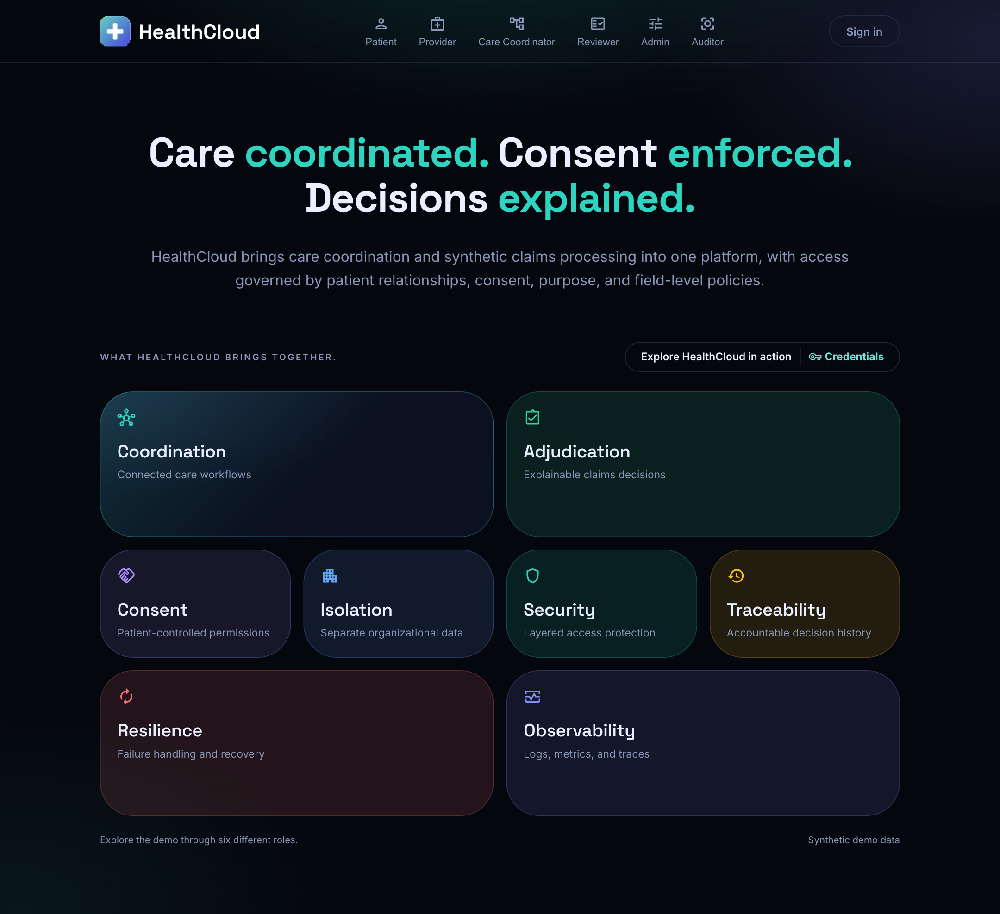
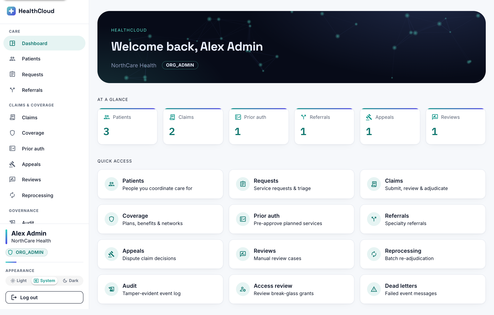
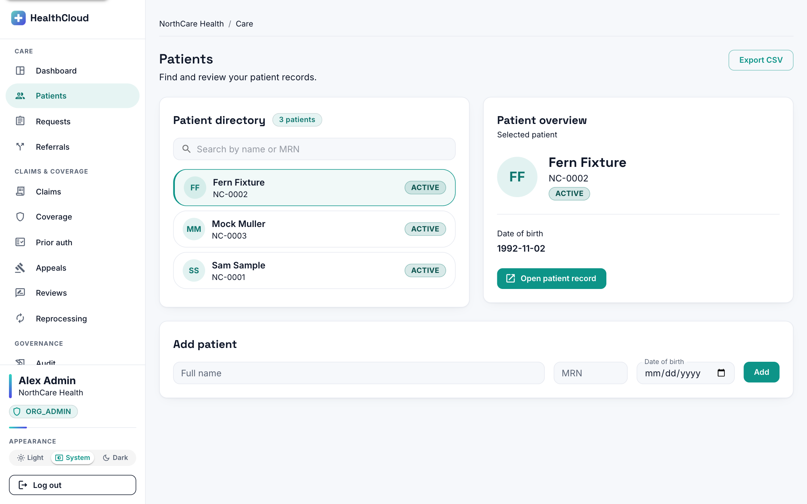
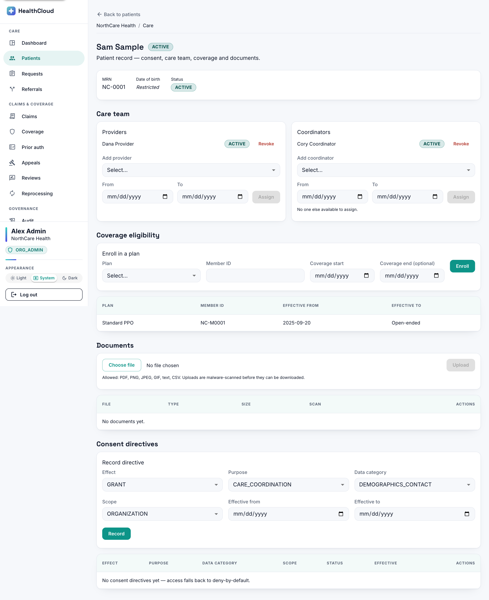
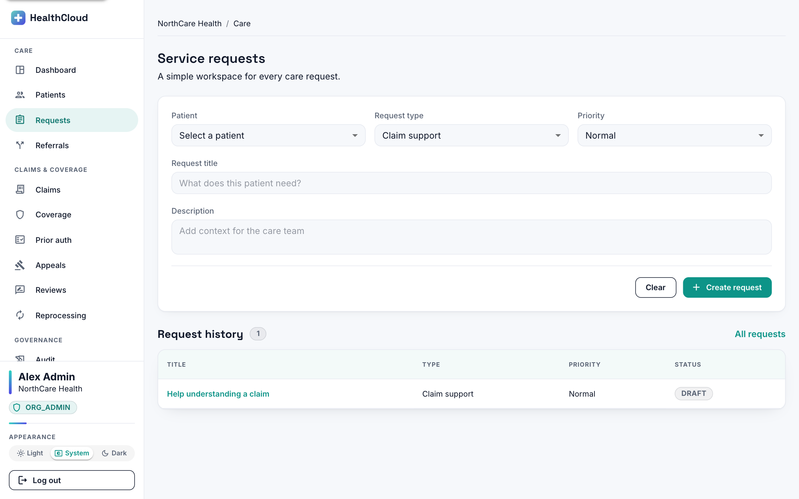
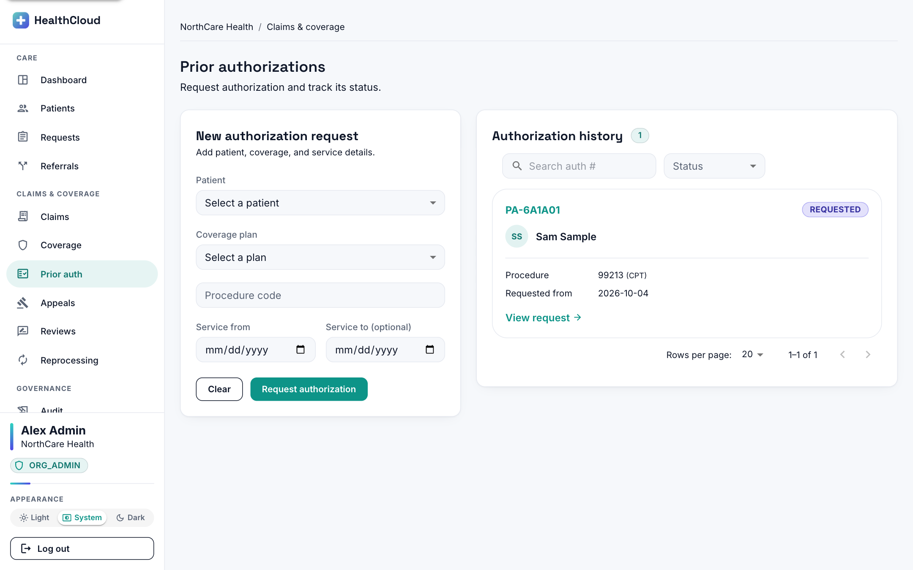
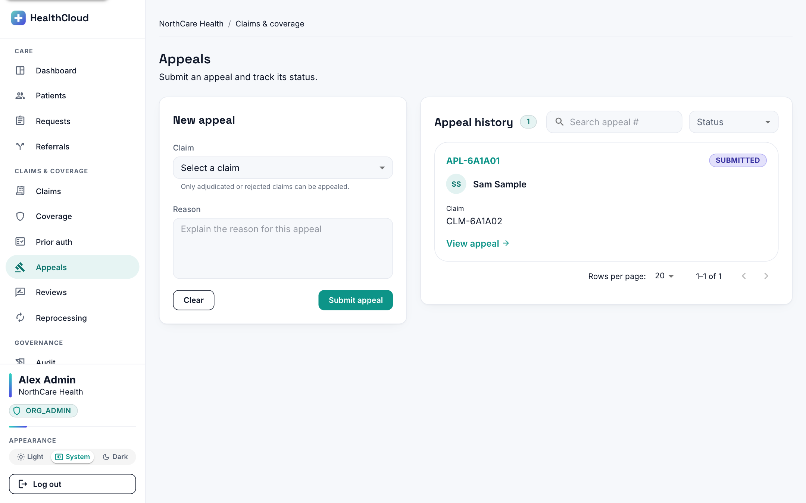
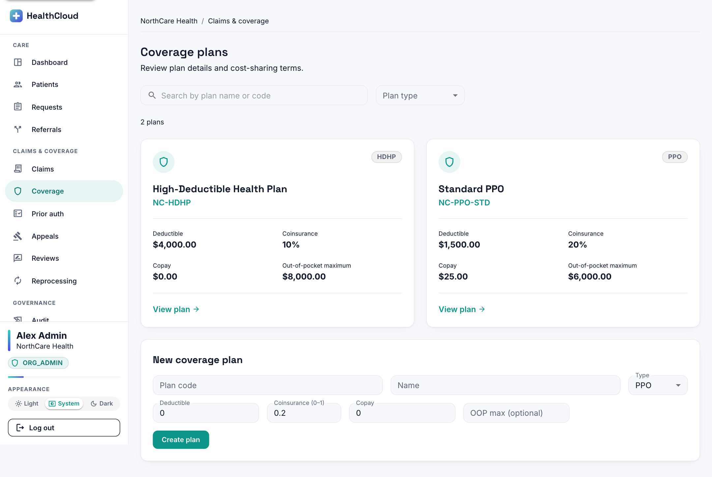
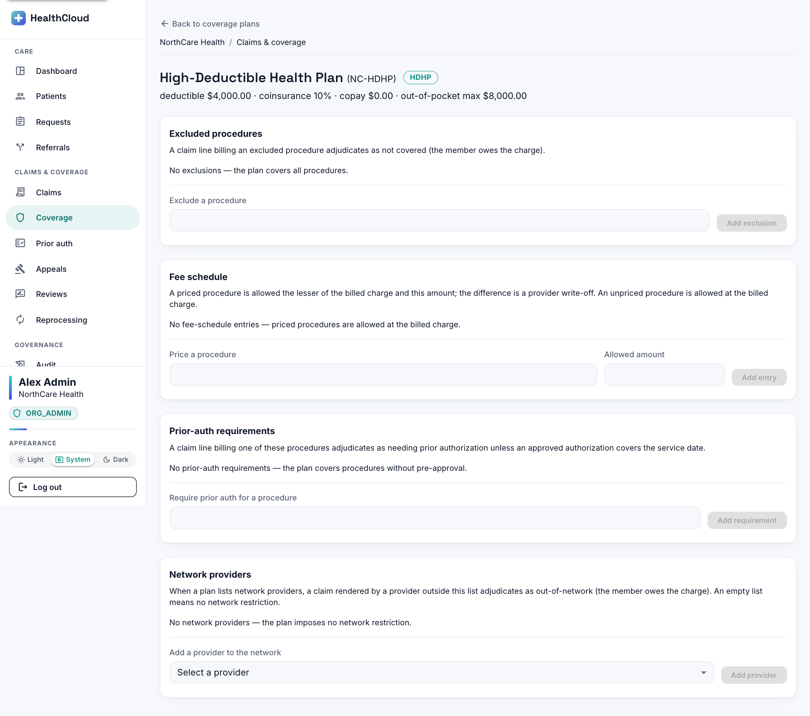
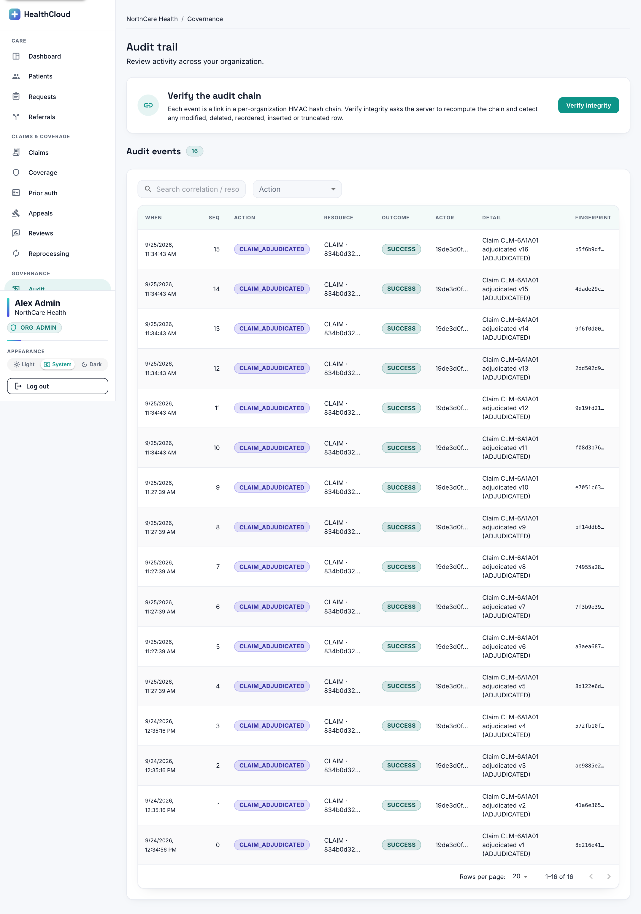

# Evidence — Application UI (every major screen)

> Captured 2026-09-25 from the running app (React + Vite frontend → Spring Boot backend, `local`
> profile, synthetic seed), signed in as an **ORG_ADMIN** (Alex Admin, NorthCare Health). All data is
> synthetic. Screens are shown full-page.

## First impression

### Landing page (unauthenticated)
The bespoke dark landing at `/login` — the headline "Care coordinated. Consent enforced. Decisions
explained.", the six role personas, and a bento grid of what the platform brings together. Sign-in is
via Cognito on the deployed build; here the dev-login stand-in backs local sign-in.



### Dashboard
A constellation hero band + an "At a glance" row of **real, role-gated counts** (pulled from the paged
endpoints' `totalElements`, never fabricated) + a role-aware launchpad.



## Care

### Patients directory
The tenant's patients. A provider would see only assigned patients here (relationship gate); an
ORG_ADMIN sees the whole tenant.



### Patient detail — masking + consent + care team
The flagship privacy screen. **Date of birth reads "Restricted"** — the backend masked it
(deny-by-default) and the SPA only renders the state. Below: the care team (providers/coordinators),
coverage eligibility, documents (malware-scanned), and the consent-directive recorder.



### Requests queue
The Phase-2 care-coordination workflow queue.



## Claims & coverage

### Claim adjudication — the explainable money decision (§60)
The heart of the platform: for an adjudicated claim, the **per-line breakdown** — allowed, copay,
deductible, coinsurance, OOP-max, plan-paid, member — so *how every amount was computed* is visible.
Plus the immutable **version history** (re-adjudication appends versions) and the status timeline.


### Prior authorization queue


### Appeals queue


### Coverage plans + plan detail
The benefit-plan admin: the plan grid, and a plan's detail with the exclusions / fee-schedule /
prior-auth-requirement / network-provider cards the adjudication engine reads.




## Governance

### Audit trail — tamper-evident hash chain
The auditor-facing event log. Each row shows its **fingerprint** (the per-org HMAC `entryHash`), and
"Verify integrity" recomputes the whole chain server-side to detect any modified / deleted / reordered
/ inserted / truncated row.



## What this shows

The application runs end-to-end across care coordination, claims & coverage, and governance — with the
security model **visible in the UI**: relationship-gated lists, a "Restricted" masked field, consent
recording, an explainable adjudication breakdown, and a tamper-evident audit trail.

## Reproduce

```bash
docker compose up -d postgres kafka
cd backend && ./mvnw spring-boot:run -Dspring-boot.run.profiles=local
cd frontend && npm install && npm run dev      # http://localhost:5173
# sign in via the local "Developer sign-in" (admin@northcare.example.org) and browse.
```
