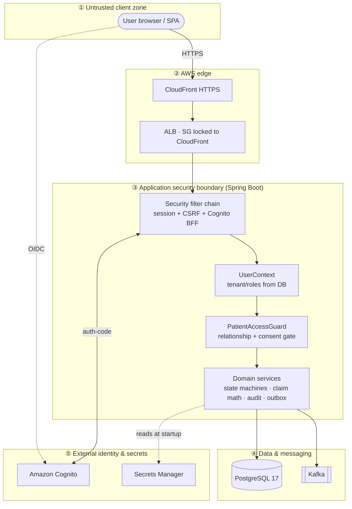

# HealthCloud — Threat Model

> A **STRIDE** threat model applied to HealthCloud's *actual* trust boundaries and mitigations. Every
> mitigation below points at a mechanism that really exists in the codebase; residual risks and out-of-scope
> areas are stated honestly (per the project's "no unmeasured / no overstated claims" rule). The system runs on
> **synthetic data only** — it is healthcare-*inspired* and HIPAA-*aligned*, not certified.

- [1. Scope & method](#1-scope--method)
- [2. Assets](#2-assets)
- [3. Trust boundaries & data-flow diagram](#3-trust-boundaries--data-flow-diagram)
- [4. STRIDE analysis](#4-stride-analysis)
- [5. Security controls summary](#5-security-controls-summary)
- [6. Residual risks & honest limitations](#6-residual-risks--honest-limitations)
- [7. Assumptions & trust](#7-assumptions--trust)

---

## 1. Scope & method

**Method.** STRIDE — Spoofing, Tampering, Repudiation, Information disclosure, Denial of service, Elevation of
privilege — applied per trust boundary rather than as a generic checklist.

**In scope:** the application's own security boundary — authentication/session handling, multi-tenant isolation,
the layered authorization pipeline (relationship → consent → field visibility), claim/financial integrity, the
audit trail's integrity, and the event-driven pipeline.

**Out of scope (noted honestly, not silently):** infrastructure/network hardening beyond what the app controls,
physical security, supply-chain security of third-party dependencies, and volumetric denial-of-service — see
[§6](#6-residual-risks--honest-limitations). These are acknowledged, not claimed to be solved.

**Guiding principle:** *the backend is the only security boundary.* The SPA may hide or disable UI for
convenience, but every protected decision is made server-side from a backend-derived identity — never from
client-supplied tenant/role/patient values.

---

## 2. Assets

| Asset | Why it matters |
|---|---|
| **Synthetic patient data (PHI-shaped)** | The data the whole access model protects; cross-tenant or unconsented exposure is the primary risk being modelled. |
| **Tenant isolation** | NorthCare must never see Green Valley's data; the core multi-tenant guarantee. |
| **Consent decisions** | Consent + purpose determine field visibility; a bypass leaks controlled fields. |
| **Claim & financial integrity** | Adjudication computes money; double-apply or tampering corrupts financial outcomes. |
| **Audit trail integrity** | The record that a sensitive action happened; if forgeable, accountability is lost. |
| **Sessions & credentials** | Session cookies and the OIDC flow; theft/forgery enables impersonation. |
| **Secrets** | DB and Cognito client secrets; disclosure enables direct data/identity-provider access. |

---

## 3. Trust boundaries & data-flow diagram

Each dashed box is a trust boundary; data crossing one is untrusted until validated on the far side.

**Boundaries:** ① browser↔edge (fully untrusted input), ② edge↔app (CloudFront is the only intended path to the
ALB), ③ the **application boundary** (where all authorization happens), plus the *logical* tenant↔tenant and
user↔user boundaries enforced inside ③, ④ app↔data, ⑤ app↔external services.

---

## 4. STRIDE analysis

Each row: the threat → the mitigation **actually implemented** (with a code pointer) → the residual risk.

### S — Spoofing (identity)

| Threat | Mitigation (implemented) | Residual |
|---|---|---|
| Forge/replay a session to act as another user | Session-based auth with an **HttpOnly** `SESSION` cookie (Spring Session JDBC); unauthenticated protected requests → 401 (`SecurityConfig`) | Session theft via a compromised endpoint device is out of app scope |
| Cross-site request forgery (state-changing calls) | **CSRF handshake** — readable `XSRF-TOKEN` cookie + required `X-XSRF-TOKEN` header (`CookieCsrfTokenRepository.withHttpOnlyFalse()` + `CsrfTokenRequestAttributeHandler` in `SecurityConfig`) | — |
| Client claims a different tenant / role / user id | **Never trusted from the client** — org & roles are resolved fresh **from the DB by email** each request (`UserContextFilter` → `UserContext`); tenant derived server-side | Correctness depends on the IdP asserting the right email (see §7) |
| Impersonate the identity provider | OIDC **authorization-code + PKCE** via Cognito; the backend BFF holds a confidential client secret | Trust in Cognito as IdP (§7) |

### T — Tampering (integrity)

| Threat | Mitigation (implemented) | Residual |
|---|---|---|
| Alter/delete/reorder audit records to hide an action | **Tamper-evident per-org HMAC-SHA256 hash chain** — each `audit_event` carries `sequenceNo`/`prevHash`/`entryHash`; the tip is a `PESSIMISTIC_WRITE`-locked `audit_chain_head`; `AuditHashChain` computes the fingerprint and `GET /audit-events/verify` detects any modified/deleted/reordered/inserted/truncated row | An attacker with **both** DB write **and** the config master secret could forge a chain (§7) |
| Concurrent edits silently overwrite each other | **Optimistic locking** — client-supplied `expectedVersion` vs the row's `@Version` (36 versioned entities); mismatch → 409 | — |
| Double-apply financial amounts under concurrency | **Row locks on financial accumulators** — `benefit_accumulator` read-and-updated under `PESSIMISTIC_WRITE` (`BenefitAccumulatorRepository.lockByKey`); insert-if-absent before the locked read | — |
| Duplicate event processing corrupts derived state | **Idempotent consumer** — dedupe on `event_id` (`existsByEventId`) with a `UNIQUE(event_id)` backstop; outbox publish is at-least-once by design | — |
| Tamper with data crossing tenants via a child row | **FK-with-org** — child rows reference `parent(id, organization_id)`, so a row can't be re-parented across tenants | — |

### R — Repudiation

| Threat | Mitigation (implemented) | Residual |
|---|---|---|
| "I never adjudicated / revoked consent / broke glass" | **Append-only audit events** written **in the same transaction** as the action (`AuditService.record(...)` joins the caller's tx); coded action + actor + `resourceType/Id` + outcome, made tamper-evident by the hash chain above | Only wired actions are audited (see §6) |
| Untraceable request | Per-request **correlationId** (`CorrelationIdFilter`, MDC-logged, echoed as `X-Correlation-Id`) recorded on history + audit rows | — |

### I — Information disclosure

| Threat | Mitigation (implemented) | Residual |
|---|---|---|
| One tenant reads another tenant's data | **Tenant scoping** — tenant-owned rows loaded by `(organization_id, id)`; a cross-tenant id is simply **not found** → **secure 404** (never a 403 that confirms existence). Proven by `TenantIsolation*` tests | — |
| A provider reads a patient they have no relationship with | **`PatientAccessGuard.requireAccessibleInTenant`** — the single choke-point every patient-scoped read routes through; unassigned → secure 404 | — |
| Read a consent-controlled field without consent | **Deny-by-default field masking** — the read's purpose is fixed on the backend; `ConsentPolicyService.decideForActor` gates each field; masked value returned as `null` + named in `maskedFields` (`PatientService`, `PatientDto.masked`) | — |
| Masked/omitted data leaks via logs, errors, or events | **PHI-free by design** — errors use `{code,message,correlationId,details}` with no sensitive text; event/audit payloads carry only coded ids + amounts | Depends on discipline for new code (reviewed by the `security-reviewer` subagent) |
| Secrets exposed in code or state | **Secrets Manager injection** — DB + Cognito secrets injected into the ECS task via `valueFrom` (`ecs.tf`), read by an execution-role `secretsmanager:GetSecretValue`; never in source or Terraform state | Audit HMAC master secret is a **config value** (§6) |

### E — Elevation of privilege

| Threat | Mitigation (implemented) | Residual |
|---|---|---|
| Perform an action above one's role | **Backend role gates** (`UserContextAccessor.requireAnyRole(...)`) on every protected write, off the caller's *actual* DB roles; UI gating is convenience only | — |
| Reach a status by skipping its guarded command | **Engine-owned statuses** — e.g. `ADJUDICATED`/`ASSIGNED` reachable only via their dedicated command, not a bare status `PATCH`; transitions validated by pure state-machine policy classes | — |
| Abuse emergency access to reach any patient | **Break-glass is constrained** — a PROVIDER self-grants **time-boxed** access with a recorded reason; overrides **only** the relationship layer (never tenant isolation or consent masking); auto-expires, revocable early, and every invoke/revoke is audited | Self-service (no pre-approval) — intentional for emergencies; audited after the fact |
| Bypass auth via the local dev-login on the deploy | **`dev-login` is `local`-profile-only**; the deploy runs `demo,cognito` (Cognito the only path). Asserted by `DeployProfileNoDevLoginTest` | — |

### D — Denial of service

| Threat | Mitigation (implemented) | Residual |
|---|---|---|
| Volumetric / application-layer flooding | CloudFront + ALB absorb some edge load; pagination caps page size (`PageRequests` clamps to ≤100) | **Largely out of scope** — there is **no app-level rate limiting** yet; a documented follow-up |
| A poison message stalls the consumer | Structural failures skip retries → **dead-letter topic**; a bounded retry/backoff precedes it | — |

---

## 5. Security controls summary

Defense-in-depth — access must survive **every** layer, and each can only *narrow* it:

1. **Tenant** — org-scoped queries; cross-tenant → secure 404.
2. **Authentication & session** — Cognito OIDC BFF, HttpOnly session cookie, CSRF handshake.
3. **Role / function** — backend `requireAnyRole` gates.
4. **Object / relationship** — the single `PatientAccessGuard` choke-point (+ time-boxed break-glass).
5. **Consent + purpose** — deny-by-default policy engine, backend-fixed purpose.
6. **Field-level masking** — field-safe DTOs; masked → `null` + `maskedFields`.
7. **Integrity** — optimistic locking, financial row locks, idempotent consumer, one-transaction writes.
8. **Accountability** — append-only, HMAC-hash-chained audit trail + verify endpoint.
9. **Secrets** — Secrets Manager injection; never in code/state.

---

## 6. Residual risks & honest limitations

- **No application-level rate limiting** — volumetric DoS is out of scope; only edge (CloudFront/ALB) and page-size
  clamping apply today.
- **Audit HMAC master secret is a config value** with an env-overridable dev default (`healthcloud.audit.hmac-secret`,
  see `AuditSigningKeys`) — a production deployment should source it from a KMS/HSM. Until then, an attacker with
  *both* DB write access *and* the secret could forge the chain.
- **MFA is available but not enforced** in the Cognito pool (OPTIONAL/TOTP) — a hardening follow-up.
- **ALB origin trust** — the ALB SG is locked to CloudFront's origin-facing prefix list, but a per-distribution
  secret origin-verify header is a documented follow-up (the prefix list still admits any account's CloudFront).
- **Single-instance outbox relay** — at-least-once via a scheduled poller; multi-instance needs
  `SELECT … FOR UPDATE SKIP LOCKED`.
- **Audit coverage is incremental** — the trail records the wired sensitive actions (adjudication, consent revoke,
  break-glass, retention, dead-letter replay); remaining actions gain audit events as the log matures.
- **Accessibility/security reviews are aligned, not certified** — a `security-reviewer` subagent encodes these
  invariants and runs before security-sensitive commits, but there is no third-party audit.
- **Synthetic data only** — no real PHI is present, so real-world PHI-handling obligations are simulated, not met.

---

## 7. Assumptions & trust

- **Amazon Cognito is trusted** as the identity provider and asserts a correct, verified `email`; the app maps that
  email to an ACTIVE `AppUser` and derives all authority from the DB (`CognitoOidcUserService` rejects a login with
  no ACTIVE user).
- **AWS IAM, Secrets Manager, and RDS encryption** are trusted to protect secrets and data at rest.
- **The audit HMAC master secret is confidential** and held outside the database it protects (see §6 for the
  current limitation).
- **Operators act in good faith** for self-service emergency access (break-glass is audited, not pre-approved).
- **TLS/HTTPS** terminates at CloudFront; the CloudFront→ALB hop is within AWS.

---

See the **[architecture diagrams](../architecture/architecture.md)** for the runtime view, the
**[ER diagram](../er-diagram/er-diagram.md)** for the data model, and the main **[README](../../README.md)** for
the project overview.
